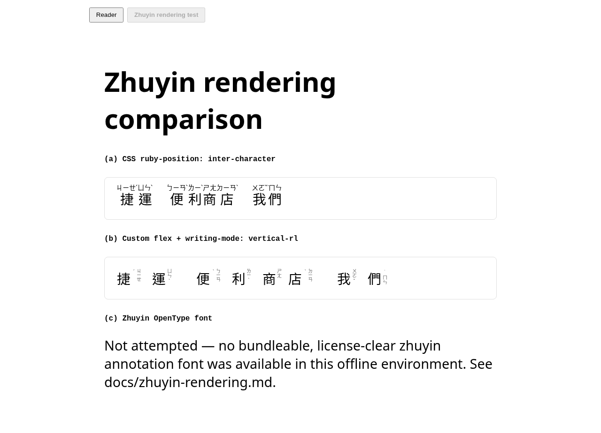
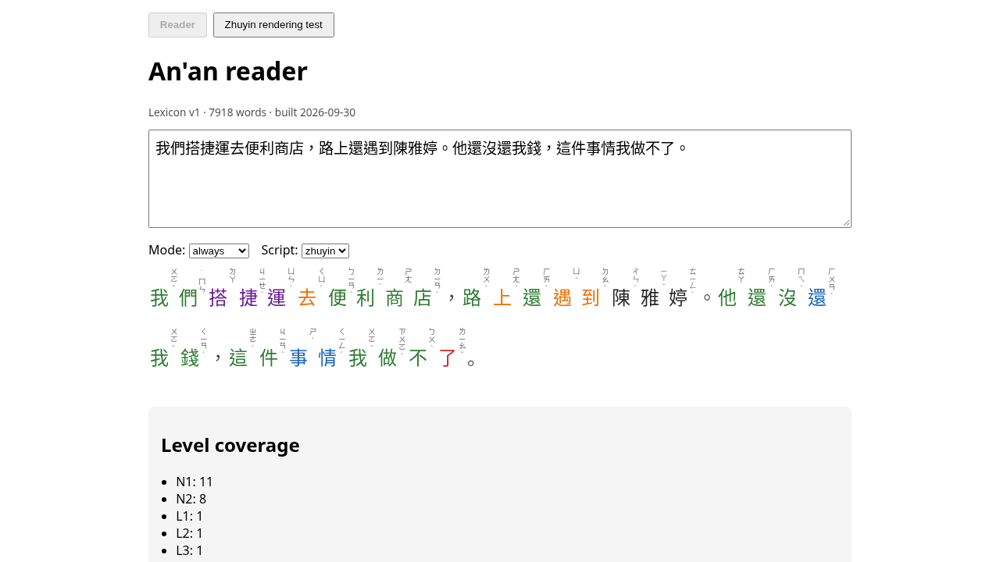
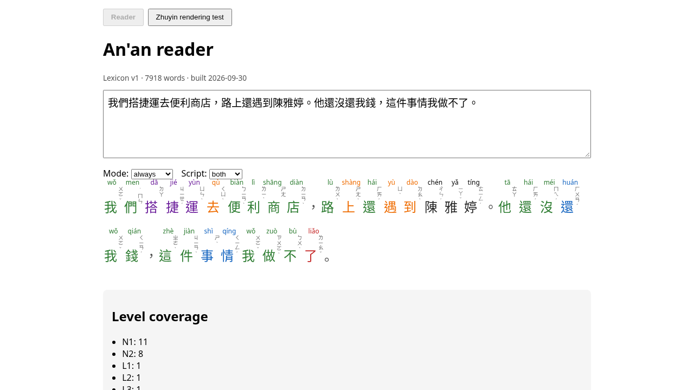

# Zhuyin rendering: approach comparison and decision

Phase 1 brief §9 asks for a build-first-test-page comparison of three ways to
render zhuyin (bopomofo) annotations — traditionally a narrow column of 1–4
symbols stacked vertically immediately to the right of each character, when
the surrounding text is horizontal — before picking one for `<AnnotatedText>`.

Test page: `apps/web/src/pages/ZhuyinTestPage.tsx` (`/?page=zhuyin-test`).

## (a) CSS `ruby-position: inter-character`

This is the value the CSS Ruby Layout spec defines specifically for
bopomofo. In theory: `<ruby>捷<rt>ㄐㄧㄝˊ</rt></ruby>` with
`ruby-position: inter-character` should stack the `<rt>` vertically beside
the base character.

**Result in this environment (Chromium, headless, `chrome-headless-shell`
153.0.8010.12 via Playwright):** falls back to default `over` positioning —
the zhuyin renders as a horizontal string *above* the word, indistinguishable
from ordinary pinyin ruby. Screenshot:

(Top sample, labelled "(a)".) This matches the real-world state of
`ruby-position: inter-character` support: it was pulled from later drafts of
the CSS Ruby spec and never got solid engine support, so relying on it in
2026 Chromium still doesn't work.

## (b) Custom flex layout, one column per character

Each character gets its own inline-flex cell: the hanzi, then a sibling
`` holding that character's zhuyin syllable with
`writing-mode: vertical-rl; text-orientation: upright`. `writing-mode` is a
much older, broadly-supported CSS feature (it's the standard way to set
vertical Japanese/Chinese body text), so leaning on it instead of
`ruby-position` is the safer bet.

**Result in this environment:** renders correctly — each syllable's bopomofo
glyphs stack vertically immediately beside their character, exactly matching
print convention. Screenshots:

(bottom sample, labelled "(b)")

## (c) Zhuyin OpenType font

Not attempted. This would mean shipping a font whose glyph substitution
rules render a hanzi+following-bopomofo run as a composed vertical
annotation automatically (no per-character markup needed). No such font
with a license clear for bundling into this repo was available in this
offline build environment. Worth revisiting later — search candidates:
fonts distributed with Taiwan's MOE-adjacent open-data releases, or a
custom-built font subset — but `(b)` already works and has no font-licensing
or file-size cost, so there's no urgency.

## Decision

**`AnnotatedText` uses approach (b)** — `packages/web`'s
`ZhuyinWord`/`.an-zhuyin-col` in `apps/web/src/components/AnnotatedText.tsx`.
Pinyin mode uses plain `<ruby>`/`<rt>` (that one *does* work correctly
everywhere ruby is supported, including this Chromium build — only the
bopomofo-specific `inter-character` value is the problem).

## Open item — not verified here

This sandboxed environment only has headless Chromium available (no GUI, no
Safari/Firefox, no iOS simulator). **Safari (iOS/macOS) and Firefox
rendering of approach (b) has not been verified** — `writing-mode` +
`text-orientation: upright` are both long-standing, widely-implemented CSS
features so it's a reasonable bet, but per CLAUDE.md "Open items to verify,
not assume": **check on a real device/browser before relying on this for
release**, and add a `text-orientation: upright` fallback check (some older
WebKit builds only supported `text-orientation: sideways-right`, which
would rotate the bopomofo glyphs 90° instead of keeping them upright).
